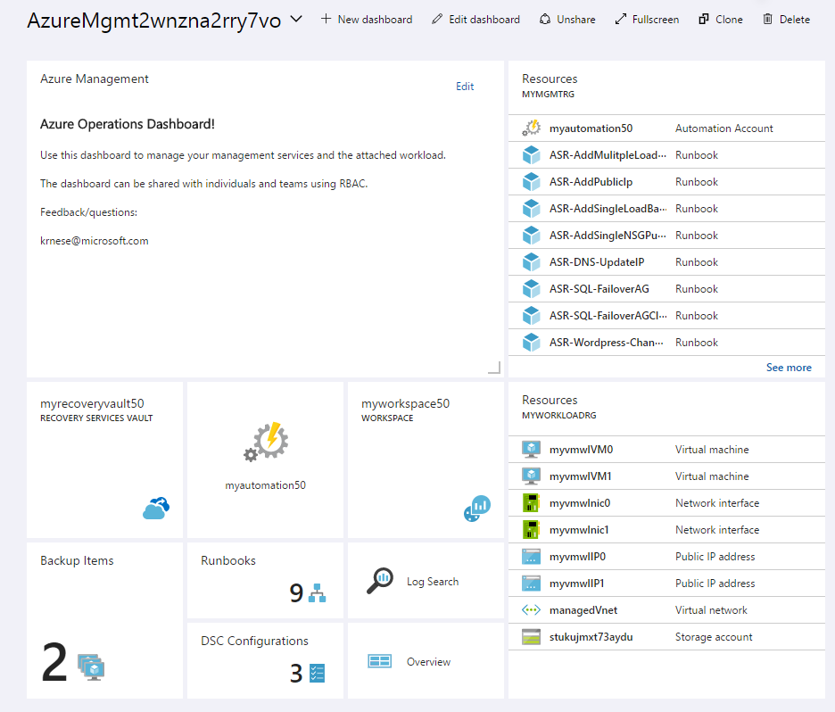

# Azure Management Services

>Note: The purpose of these templates, is to give you a kick-start, instantiating all of the Azure mgmt services in Azure.
The mgmt. services will be fully integrated, and you will have VM workloads which will be fully managed as part of the deployment.
**Please note that this sample is for demo purposes only**

## How to deploy
These templates should be deployed using PowerShell, as you need to create two resource groups prior to submitting the deployment. 
The guidance below shows a sample script, where you only have to provide your unique values to the variables.

```powershell

# Create 2 resource groups, for mgmt and workload
$MgmtRgName = '' # Specify name for the resource group containing the management services
$WorkloadRgName = '' # Specify the name for the resource group containing the virtual machine(s)

$MgmtRg = New-AzureRmResourceGroup -Name $MgmtRgName -Location westeurope -Verbose
$WorkloadRg = New-AzureRmResourceGroup -Name $WorkloadRgName -Location westeurope -Verbose

# Define parameters for template deployment - remember to change the values!

$OMSWorkspaceName = '' # Specify the prefix for the OMS Workspace
$OMSWorkspaceRegion = '' # Select the region for your workspace
$OMSRecoveryVaultName = '' # Specify the prefix for the Recovery Vault
$OMSRecoveryVaultRegion = '' # Select the region for your Recovery Vault
$OMSAutomationName = '' # Specify the prefix for the Azure Automation account
$OMSAutomationRegion = '' # Select the region for the Automation account
$Platform = '' # Select either 'Windows' or 'Linux'
$userName = '' # username for the VM
$vmNameSuffix = '' # Specify the suffix for the virtual machine(s) that will be created
$instanceCount = '' # You can create 1-10 VMs
$deploymentName = '' # Specify the name of the main ARM template deployment job
$templateUri = 'https://raw.githubusercontent.com/Azure/azure-quickstart-templates/azmgmt-demo/azuredeploy.json'
# Deploy template

New-AzureRmResourceGroupDeployment -Name $deploymentName `
                                   -ResourceGroupName $MgmtRg.ResourceGroupName `
                                   -TemplateUri $templateUri `
                                   -vmResourceGroup $WorkloadRg.ResourceGroupName `
                                   -omsRecoveryVaultName $OMSRecoveryVaultName `
                                   -omsRecoveryVaultRegion $OMSRecoveryVaultRegion `
                                   -omsWorkspaceName $OMSWorkspaceName `
                                   -omsWorkspaceRegion $OMSWorkspaceRegion `
                                   -omsAutomationAccountName $OMSAutomationName `
                                   -omsAutomationRegion $OMSAutomationRegion `
                                   -vmNameSuffix $vmNameSuffix `
                                   -userName $userName `
                                   -platform $platform `
                                   -instanceCount $instanceCount `
                                   -verbose
```
Navigate to [Azure Portal](https://portal.azure.com) and find the newly created dashboard, which will have the following naming convention *AzureMgmt(uniqueString(deployment().name))*:

